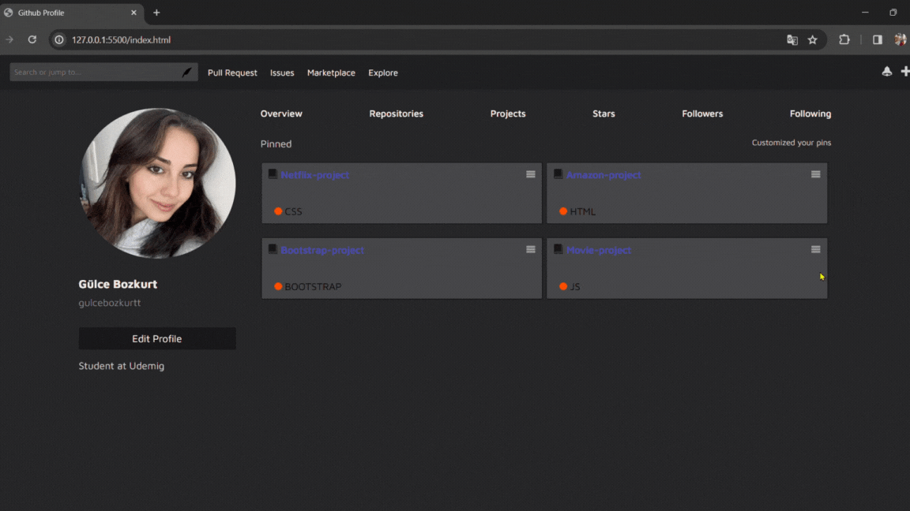

# github-profile-page
- This code represents a template for the user profile page on the GitHub platform. It includes sections for icons, links, user information, and projects.

- Design used HTML ans SCSS.

## Gif

